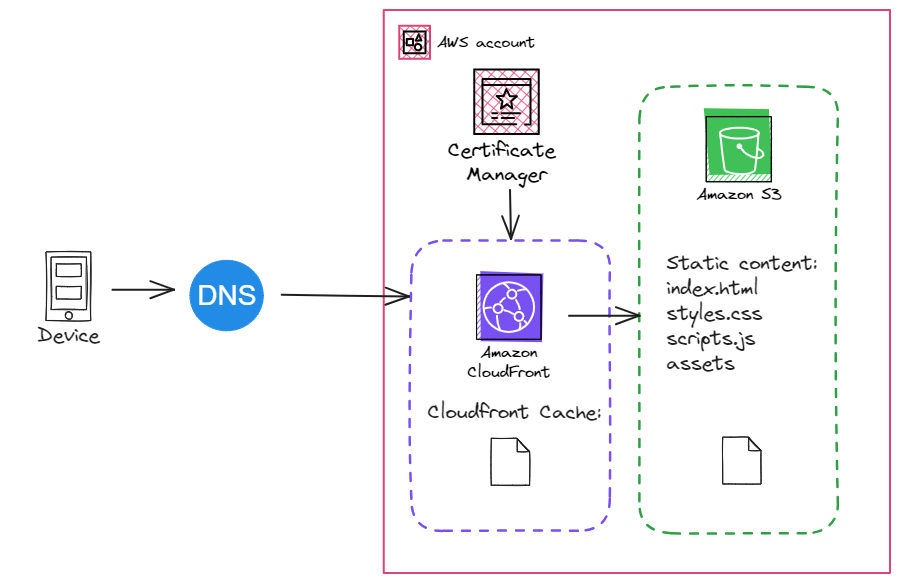

# AWS S3 Static Website Hosting
## Overview
The project involves deploying a static website on Amazon Web Services (AWS) using Amazon S3 for storage, CloudFront for content delivery, and Certificate Manager for securing the website with HTTPS.
## Architecture Diagram

## Prerequisites
1. Website Files.
1. Amazon Web Services (AWS) Account.
1. Domain Name. (Optional)
1. Github Account (Optional)
## AWS Free Tier
* **12 months free:**
    * Amazon S3:
        * 5GB Standard Storage
        * 20K GET Requests / month
        * 2K PUT Reuquests / month
* **Always free:**
    * Amazon CloudFront:
        * 1TB of Data Transfer / month
        * 10,000,000 HTTP or HTTPS Requests / month
    * AWS Certificate Manager:
        * Public SSL/TLS certificates provisioned through AWS Certificate Manager are free.
## Process 
1. S3 Configuration:

    * Create an S3 bucket.
    * Upload the website files.
    * Configure the S3 bucket policy for public access.
1. CloudFront Configuration:

    * Create a CloudFront distribution.
    * Specify the S3 bucket as the origin.
    * Configure caching behavior and additional settings.
1. Domain and Certificate:

    * Register a domain or use an existing one.
    * Request an SSL/TLS certificate from ACM for the custom domain.
1. Certificate Validation:

    * Complete the ACM certificate validation process.
1. CloudFront Update:

    * Update the CloudFront distribution to use the ACM certificate for HTTPS.
1. DNS Configuration:

    * Update DNS records to point to the CloudFront distribution.